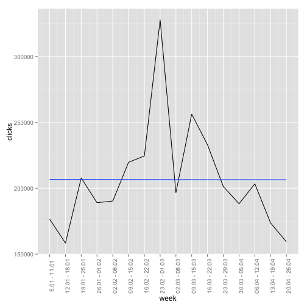
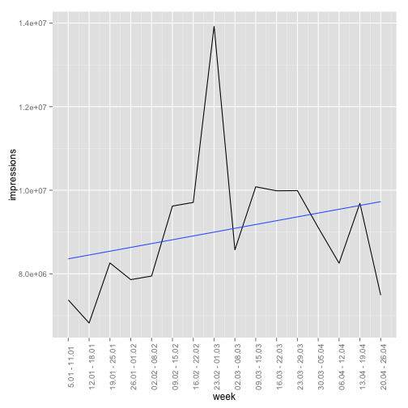
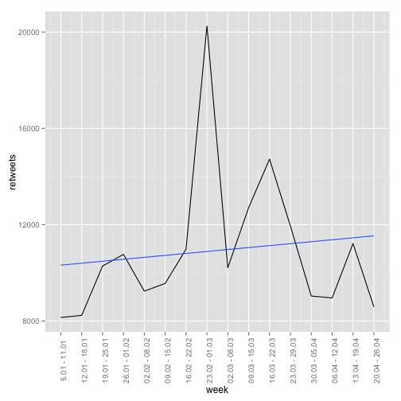
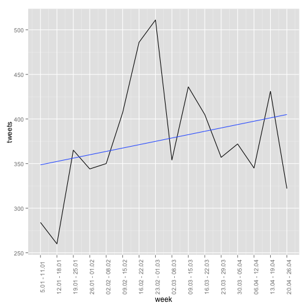
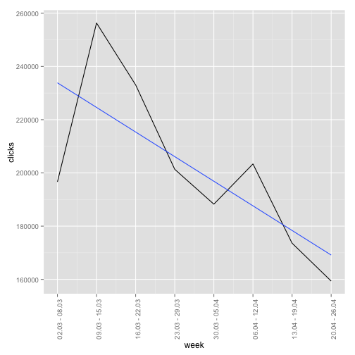
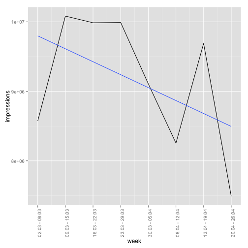
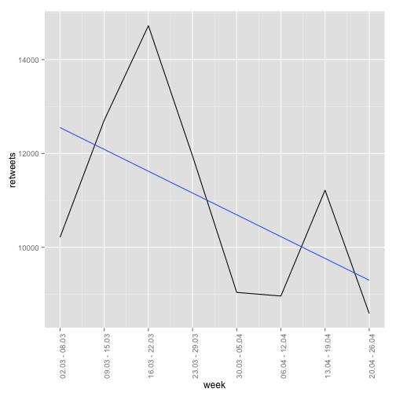
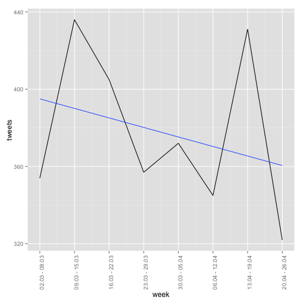

Моя теория потерпела полный крах. Падение кликов, импрешшинов (просмотров) и ретвитов налицо. 

Для начала график кликов со 2-й недели года по 17-ю (первую и последнюю я убрал, потому что они неполноценные, в смысле там не семь дней). 5 января по 24 апреля короче

 

Импрешнс за тот же период


```r
#impressions ((5.01 - 26.04)) by weeks
ggplot(stat, aes(week, impressions)) +
        geom_line() + 
        geom_smooth(method = "lm", se = FALSE) + 
        scale_x_continuous(breaks=2:17, labels = datessign) + 
        theme(axis.text.x = element_text(angle = 90))
```

 

Ретвиты:


```r
#retweets ((5.01 - 26.04)) by weeks
ggplot(stat, aes(week, retweets)) +
        geom_line() + 
        geom_smooth(method = "lm", se = FALSE) + 
        scale_x_continuous(breaks=2:17, labels = datessign) + 
        theme(axis.text.x = element_text(angle = 90))
```

 

Количество твитов


```r
ggplot(stat, aes(week, tweets)) +
        geom_line() + 
        geom_smooth(method = "lm", se = FALSE) + 
        scale_x_continuous(breaks=2:17, labels = datessign) + 
        theme(axis.text.x = element_text(angle = 90))
```

 

То есть ты была права, что количество твитов тоже снизилось за последнее время. 

На этих четырех графиках выше хорошо виден пик — это неделя, когда убили Немцова. 

А теперь смотри какой ад начинается со **следующей недели, со 2 марта**


Клики


```r
clck
```

 

импрешнс

```r
impr
```

 

Ретвиты


```r
ret
```

 

ну и количество твитов:


```r
ggplot(tenseven, aes(week, tweets)) +
     geom_line() + 
     geom_smooth(method = "lm", se = FALSE) + 
     scale_x_continuous(breaks=10:17, labels = c("02.03 - 08.03", "09.03 - 15.03","16.03 - 22.03", "23.03 - 29.03", "30.03 - 05.04", "06.04 - 12.04", "13.04 - 19.04", "20.04 - 26.04")) + 
     theme(axis.text.x = element_text(angle = 90))
```

 

А еще [смотри](https://analytics.twitter.com/analytics_help#glossary), вот откуда расхождение в количестве твитов у них на сайте и количестве реально отправленных твитов за период. 

Tweet
Includes Tweets that link to any web page containing a meta tag for your primary account. For example, if you’re accessing @NYTimes data, we will collect all Tweets with any URL containing this tag: <meta name="twitter:site" value="@nytimes">. The number of Tweets shown includes any Tweet which was viewed at least once during the specified date range. This can include Tweets sent before the date range, as long as they were viewed or interacted with during that time.
